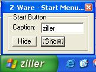



## Start Menu Fun  ;\) \- Changes the caption of startmenu, hides, shows it\.

### Description

This might change the caption of your StartMenu. Works on XP. It might also Show/Hide the startmenu button. *rate if u like*
 
### More Info
 

             |
---                |---
**Submitted On**   |2003-05-05 08:03:10
**By**             |[TJWeb](https://github.com/Planet-Source-Code/PSCIndex/blob/master/ByAuthor/tjweb.md)
**Level**          |Intermediate
**User Rating**    |4.0 (20 globes from 5 users)
**Compatibility**  |VB 6\.0
**Category**       |[Windows API Call/ Explanation](https://github.com/Planet-Source-Code/PSCIndex/blob/master/ByCategory/windows-api-call-explanation__1-39.md)
**World**          |[Visual Basic](https://github.com/Planet-Source-Code/PSCIndex/blob/master/ByWorld/visual-basic.md)
**Archive File**   |[Start\_Menu158476572003\.zip](https://github.com/Planet-Source-Code/tjweb-start-menu-fun-changes-the-caption-of-startmenu-hides-shows-it__1-45320/archive/master.zip)

